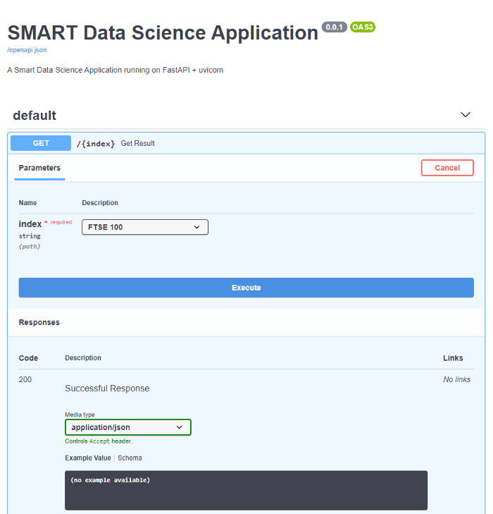

<h1 align="center">Data Science Application Using FastAPI</h1>
<a href="#">
  <div align="center">
    
  </div>
</a>
# Overview

This is a simple Data Science Application that demonstrates the use of Python, FastApi, pandas and web scraping.


The application scraps a dataset in a web page to form a restful web api endpoint that can be subsequently used for data analysis and visualiation for better decision making by stakeholders.
To use this Application follow these step: 

```
git clone https://github.com/nelson-ust/Data_science_application.git
cd SmartApp/src
pip install -r requirements.txt
uvicorn main:app --reload
```


## Functionalities
- [x] Web Scraping
- [x] Restful web api

[Software Demo Video](http://youtube.link.goes.here)

# Development Environment

1. Visual studio Code was the development tool used in developing this App. This is one of my favorites because it is lightweight and flexible. 
2. The Python programming language with python3.8 was used to complete this project. It is very easy to use,  unique language and serves as a multi purpose language. I used the pandas library.
3. I used GitHub for version control. 


# Useful Websites

* [Python](https://docs.python.org/3/)
* [Stack Overflow](https://stackoverflow.com/)
* [FastAPI](https://fastapi.tiangolo.com/tutorial/)
* [Pandas](https://towardsdatascience.com/getting-started-to-data-analysis-with-python-pandas-with-titanic-dataset-a195ab043c77)


## Author
You can get in touch with me on my LinkedIn Profile:

#### Nelson Attah
[](https://www.linkedin.com/in/nelson-attah-25330660/)

You can also follow my GitHub Profile to stay updated about my latest projects: [](https://github.com/nelson-ust)

If you liked the repo then kindly support it by giving it a star ⭐!

